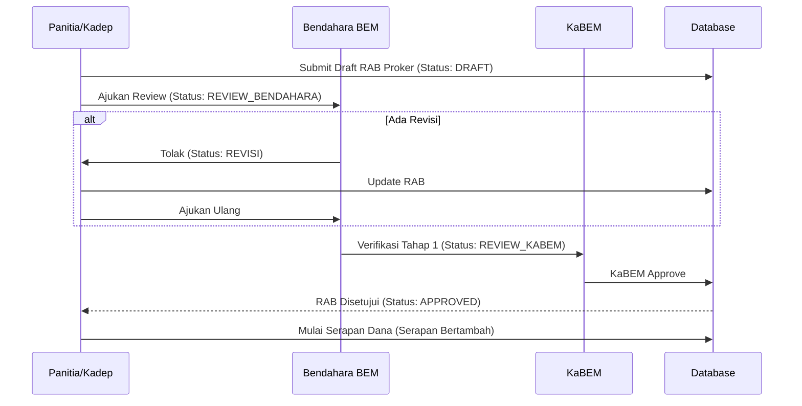

# Arsitektur & Logika Bisnis BEM FT UNESA 2026 (Detailed Version)

Dokumen ini merupakan pembedahan komprehensif mengenai arsitektur teknis, struktur *database*, hierarki *Role-Based Access Control* (RBAC), alur kerja (*workflow*), dan lapisan keamanan pada **Information Management System (IMS) BEM FT UNESA 2026**.

---

## 1. Teknologi & Infrastruktur (Tech Stack)

Sistem ini diimplementasikan menggunakan pendekatan *Monorepo* modern untuk memfasilitasi skalabilitas yang masif dan integrasi *end-to-end type safety*.

- **Frontend (Web Portals)**: Next.js 15 (App Router), React 19, Tailwind CSS 4, Framer Motion, Zustand (State Management), TanStack React Query v5.
- **Backend (API Gateway)**: NestJS 11 (TypeScript), Express.
- **Database Layer**: MongoDB 6.0 (NoSQL) menggunakan ODM Mongoose.
- **Cache & Message Broker**: Redis (mengelola sesi *auth* dan telemetri *real-time*).
- **Infrastruktur & Deployment**: Docker, Docker Compose, Caddy (Reverse Proxy & SSL Auto-Provisioning), GitHub Actions CI/CD (Ubuntu VPS).

### Struktur Direktori Monorepo
- `backend/` ➔ API utama (NestJS) yang melayani *public web* dan *ims web*.
- `frontend/` ➔ Portal utama publik (Web Company Profile).
- `ims/` ➔ Portal khusus fungsionaris (Information Management System).
- `oprec/` ➔ Portal khusus pendaftaran Panitia/Pengurus baru (Open Recruitment).
- `packages/` ➔ Modul *library* berbagi (misal: `@bemft/permissions`, `@bemft/types`, `@bemft/api-client`).

---

## 2. Struktur Database (Schema Logis)

Logika bisnis dikendalikan secara persisten di MongoDB melalui koleksi Mongoose:

1. **`users.ts`**: Skema dasar fungsionaris yang mencakup `email`, `role`, `department`, total `points`, `directGrants` (untuk modifikasi *permission* khusus).
2. **`security.ts`**: Menangani Audit Logs, Session Tracking, Mfa Devices, dan Feature Flags. Menyimpan rekaman absolut untuk *audit* Immutable (tidak bisa dihapus).
3. **`proker.ts`**: Struktur Program Kerja (Proker). Berisi *lifecycle status* (DRAFT, REVIEW, REVISI, ACTIVE, COMPLETED), data RAB, SPJ, kepanitiaan, serta rekam persetujuan (*approval history*).
4. **`documents.ts`**: Skema untuk persuratan (SOP, Surat Keluar/Masuk, Proposal). Mendukung sistem *versioning* (DocumentVersionModel) sehingga setiap revisi proposal tidak menimpa versi sebelumnya.
5. **`finance.ts`**: *Ledger* keuangan organisasi, mencatat pencairan dana, target *sponsorship*, dan pengeluaran aktual dari tiap departemen/proker.
6. **`aspiration.ts`**: Skema untuk menampung aspirasi mahasiswa Fakultas Teknik dari web publik.

---

## 3. Sistem RBAC & Keamanan Lapis Baja

Keamanan sistem dikelola dengan pola *Defense in Depth* melalui lapisan Auth Guard dan Permission Guard di NestJS.

### A. Hierarki Pewarisan (*Role Hierarchy*)
Di dalam berkas `@bemft/permissions/src/index.ts`, sistem secara otomatis menghitung warisan hak akses. Jika suatu peran diberikan kepada *Staff*, maka *Wakadep*, *Kadep*, hingga *Super Admin* secara otomatis mewarisi akses tersebut.

**Pohon Jabatan Absolut:**
`Super Admin` ➔ `KaBEM` ➔ `WaKaBEM` ➔ `Sekretaris` ➔ `Admin` ➔ `Staff` ➔ `Guest`
(Di cabang departemen: `WaKaBEM` ➔ `Kadep` ➔ `Wakadep` ➔ `Staff`)

### B. Mekanisme Evaluasi Izin (Guards)
Setiap permintaan (HTTP Request) ke API melewati lapisan keamanan:
1. **`JwtAuthGuard`**: Memvalidasi token JWT; memastikan token belum kedaluwarsa dan sesi belum di-*revoke* dari *database*.
2. **`RolesGuard`**: (*Soft Check*) Memeriksa apakah nama jabatan yang masuk (*req.user.role*) ada di daftar dekorator `@Roles()`.
3. **`PermissionsGuard`**: (*Hard Check*) Menjalankan mesin evaluasi izin. Membaca izin bawaan (*DEFAULT_ROLE_GRANTS*), izin warisan (*Inherited Roles*), dan Izin Spesifik Akun (*directGrants* dari database).

### C. Access Scope (Batasan Jangkauan)
Sistem memiliki logika *Scope* untuk memastikan keamanan data horizontal (Mencegah Aktor A melihat data milik Aktor B):
- `scope: "global"` ➔ KaBEM / Sysadmin bisa melihat seluruh data BEM.
- `scope: "department"` ➔ Kadep hanya bisa melihat/mengubah Proker dan anggota di *Departemennya sendiri*.
- `scope: "own"` ➔ Staf hanya bisa melihat Proker di mana ia ditugaskan sebagai panitia.

---

## 4. Alur Kerja Utama (Core Business Workflows)

### A. Alur Kerja Keuangan (Proposal & RAB)
Setiap pencairan dana untuk Proker wajib melewati verifikasi berjenjang.

*(Catatan: WaKaBEM di-*deny* secara eksplisit untuk membaca atau menyetujui fungsi keuangan untuk menghindari duplikasi komando anggaran).*

### B. Alur Kerja Persuratan (Approval Dokumen)
Surat menyurat resmi menggunakan *Cryptographic Signature* (TTD Digital Berbasis UUID).
1. Surat dibuat oleh Panitia.
2. Diajukan untuk ditandatangani oleh **Sekretaris Umum** (Sekum).
3. Setelah Sekum menandatangani, diteruskan ke **KaBEM**.
4. KaBEM menandatangani, lalu sistem mem-*(freeze)* dokumen (membuat *DocumentVersion* tidak bisa diubah) dan menerbitkan tautan Verifikasi Surat Publik (`/verify/[uuid]`).

### C. Sistem Gamifikasi (Poin & Leaderboard)
- **Tujuan**: Memicu kompetisi sehat antar staf.
- **Logika Validasi**: 
  - *Backend* memvalidasi melalui pelindung `@Roles('Sekretaris')`.
  - Hanya Sekretaris, WaKaBEM, KaBEM, dan Super Admin yang dapat menambahkan atau memotong poin staf. Kadep tidak diizinkan memberi poin untuk menghindari favoritisme internal departemen.
  - Dasbor akan menyembunyikan tombol "Berikan Poin" dari siapa pun yang jabatannya di bawah Sekretaris.

### D. System Console (Telemetri)
Akses khusus **Super Admin** & **Admin Sistem**:
- Menampilkan grafik waktu nyata *(Real-time Telemetry)* beban CPU VPS, Kapasitas Database, RAM, dan Bandwidth menggunakan *Polling API*.
- Menyediakan akses *Feature Flags* untuk menghidupkan/mematikan fitur secara dinamis (Misal: Matikan Mfa, Aktifkan Mode Maintenance) tanpa perlu *redeploy* server.

---

## 5. Deployment Pipeline (CI/CD)

Proses perilisan *(Release)* berjalan secara otomatis via GitHub Actions:
1. Setiap kode yang di-*Push* ke *branch* `main` memicu aksi di berkas `.github/workflows/deploy.yml`.
2. Runner GitHub melakukan SSH ke VPS Ubuntu BEM FT.
3. VPS mengeksekusi `git fetch` dan `git reset --hard` untuk mendapatkan kode terbaru secara utuh.
4. Perintah `docker compose build` membangun satu per satu citra (Image) API, Public Web, dan IMS Web untuk mencegah VPS kehabisan memori (*OOM/Out Of Memory*).
5. Layanan dimuat ulang *(Restart)* dengan mode terpisah (`up -d`). Caddy Server bertindak di depan, merutekan lalu lintas ke *container* bersangkutan sesuai *subdomain*.

---
*Dibuat & Diverifikasi pada Sistem BEM FT UNESA 2026*
