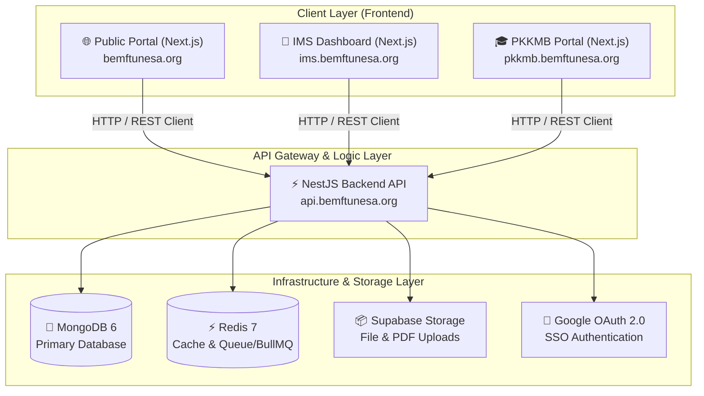

# 🏛️ Digital Ecosystem BEM FT UNESA

[](https://nextjs.org/)
[](https://nestjs.com/)
[](https://react.dev/)
[](https://tailwindcss.com/)
[](https://www.typescriptlang.org/)
[](https://www.mongodb.com/)
[](https://redis.io/)

Repositori ini merupakan pusat **Ekosistem Digital BEM FT UNESA (Kabinet Danadyaksa 2026)**. Sistem terintegrasi ini dirancang untuk mendigitalisasi operasional internal fungsionaris (IMS), menyediakan layanan advokasi publik bagi mahasiswa (Public Portal), dan ditenagai oleh API Gateway terpusat (Backend).

---

## 🗺️ Arsitektur Sistem



---

## 📦 Penjelasan Lengkap Fitur Ekosistem

### 1. 🌐 Portal Publik (`frontend/` / `bemft-unesa-web`)
Didesain khusus untuk mahasiswa Fakultas Teknik UNESA dan masyarakat umum sebagai portal informasi satu pintu dan wadah interaksi advokasi digital.

*   🏠 **Beranda (Landing Page)**:
    *   **Hero Section**: Tampilan modern dengan animasi interaktif berbasis Framer Motion yang memperkenalkan Kabinet Danadyaksa.
    *   **Quick Stats**: Penghitung statistik real-time jumlah anggota, departemen, program kerja, dan status penyelesaian aspirasi.
    *   **Agenda Timeline**: Widget daftar agenda terdekat BEM FT yang sedang berjalan atau akan dilaksanakan.
    *   **News Ticker**: Ringkasan rilis berita terbaru dengan akses cepat ke detail berita.
*   ℹ️ **Profil & Tentang**:
    *   Informasi mendalam tentang filosofi nama, logo, visi, dan misi Kabinet Danadyaksa BEM FT UNESA 2026.
*   👥 **Struktur Organisasi**:
    *   Halaman interaktif yang menampilkan pohon organisasi Badan Pengurus Harian (BPH), Badan Pengurus Inti (BPI), Kepala Departemen, hingga staf divisi lengkap dengan foto profil fungsionaris.
*   📊 **Program Kerja (Proker)**:
    *   Direktori lengkap seluruh program kerja BEM FT yang dapat dicari berdasarkan departemen, dilengkapi status progress kerja.
*   📥 **Kanal Advokasi & Kotak Aspirasi**:
    *   **Aspiration Form**: Formulir pengaduan bagi mahasiswa untuk menyampaikan keluhan seputar fasilitas kampus, banding UKT, birokrasi, atau kesejahteraan. Mahasiswa dapat mengirimkan laporan secara Anonim (tanpa nama) demi privasi keamanan.
    *   **Aspiration Tracker**: Pelacakan status pengaduan secara real-time menggunakan **ID Tiket unik**. Mahasiswa dapat melihat apakah pengaduan berstatus *Menunggu*, *Sedang Diproses*, atau *Selesai/Ditinjaklanjuti* beserta tanggapan/solusi tertulis dari BEM FT.
*   📰 **Portal Berita & Publikasi**:
    *   Daftar artikel terbagi dalam tiga kategori utama: *Kegiatan*, *Pengumuman Resmi*, dan *Opini Mahasiswa*. Dilengkapi fitur pencarian kata kunci dan filter kategori instan.
*   📞 **Hubungi Kami (Kontak)**:
    *   Formulir pesan terintegrasi untuk kerja sama eksternal, kemitraan sponsorship, dan saran masyarakat umum.

---

### 2. 💼 Internal Management System (`ims/`)
ERP (Enterprise Resource Planning) organisasi mahasiswa sebagai pusat pengelolaan administrasi, operasional, dan kepanitiaan fungsionaris BEM FT.

*   🔐 **Google SSO & Session Management**:
    *   Login sekali klik menggunakan Google Akun dengan pembatasan domain wajib `@mhs.unesa.ac.id` atau `@unesa.ac.id` untuk menjamin keamanan akses fungsionaris.
    *   Rotasi token sesi otomatis (*Refresh Token Rotation*) dan kontrol daftar perangkat tepercaya.
*   📊 **Dashboard Internal & Telemetri**:
    *   Visualisasi grafik alokasi anggaran bulanan per departemen, grafik status siklus hidup program kerja, dan visualisasi beban kerja anggota fungsionaris.
    *   **SysAdmin Telemetry**: Panel real-time untuk memantau status CPU, penggunaan memori RAM, kapasitas database MongoDB, dan kontrol Feature Flags (mengaktifkan/mematikan fitur tertentu dari jarak jauh).
*   📋 **Manajemen Program Kerja (Proker)**:
    *   **Kanban Taskboard**: Papan tugas kolaboratif (To Do, In Progress, Review, Done) untuk setiap penugasan fungsionaris.
    *   **Milestone Tracker**: Checklist pencapaian target kerja dalam program tertentu.
    *   **Ledger Keuangan Proker**: Pencatatan kas masuk dan keluar yang spesifik per kegiatan.
*   👥 **Manajemen Kepanitiaan (Ad Hoc)**:
    *   Pencatatan struktur kepanitiaan kegiatan (OC & SC), pembagian divisi kepanitiaan, dan batasan hak akses fungsionaris berdasarkan perannya dalam proker tersebut.
*   📄 **Modul Persuratan Digital**:
    *   **Automatic Numbering**: Penomoran surat otomatis berdasarkan kategori, jenis surat, dan tanggal keluar untuk menghindari nomor ganda.
    *   **Multi-Step Approval**: Alur verifikasi surat mulai dari pembuatan draf oleh staf -> verifikasi nomor oleh Sekretaris -> persetujuan ACC Sekretaris -> persetujuan akhir TTD oleh Ketua BEM.
    *   **Digital Signature**: Tanda tangan digital otomatis yang disematkan ke PDF final, dilengkapi dengan kode QR verifikasi keaslian surat yang dapat dipindai publik.
    *   **Version Control**: Manajemen riwayat revisi draf surat dengan fitur rollback.
*   💰 **Verifikasi Anggaran & RAB**:
    *   Penyusunan RAB (Rencana Anggaran Belanja) mendetail per item barang, alur pengajuan proposal kegiatan, verifikasi administrasi anggaran oleh Bendahara, dan persetujuan alokasi dana akhir oleh Ketua BEM.
    *   Pencatatan SPJ (Surat Pertanggungjawaban) dan LPJ keuangan pasca-kegiatan selesai.
*   🗓️ **Manajemen Rapat & Absensi**:
    *   **QR Attendance**: Pengelola absensi rapat otomatis menggunakan pemindaian kode QR unik yang berganti per menit.
    *   **GPS Geofencing**: Validasi koordinasi lokasi garis lintang/bujur dan radius peserta rapat untuk mencegah manipulasi kehadiran palsu.
    *   Pembuatan dan pengarsipan notulensi rapat digital.
*   📦 **Inventarisasi Aset & Peminjaman**:
    *   Pencatatan aset organisasi lengkap dengan kode identifikasi unik (misal: `BEM-2026-CHAIR-001`).
    *   Alur peminjaman aset fungsionaris dengan notifikasi pengingat pengembalian barang secara otomatis.
*   🏆 **Reward & Point Keaktifan**:
    *   Pemberian poin apresiasi atas keaktifan fungsionaris (hadir rapat tepat waktu, menyelesaikan tugas proker).
    *   Papan peringkat (*leaderboard*) keaktifan anggota per departemen.

---

### 3. 🎓 PKKMB Portal (`pkkmb/`)
Sistem informasi khusus untuk rangkaian Pengenalan Kehidupan Kampus bagi Mahasiswa Baru (PKKMB) Fakultas Teknik UNESA.

*   📅 **Manajemen Jadwal & Agenda**: Informasi jadwal kegiatan PKKMB secara *real-time*.
*   📝 **Sistem Penugasan (Assignments)**: Portal distribusi dan pengumpulan tugas mahasiswa baru.
*   ✅ **Sistem Presensi Terpusat**: Pencatatan riwayat kehadiran mahasiswa baru di setiap sesi acara.
*   🏆 **Poin Kelulusan & Rapor**: Kalkulasi akumulasi poin peserta untuk menentukan kelulusan rangkaian PKKMB.
*   👥 **Pembagian Gugus & Kelompok**: Informasi pembagian kelompok beserta mentor/pendamping masing-masing gugus.
*   📸 **Galeri Dokumentasi**: Pusat dokumentasi kegiatan selama PKKMB berlangsung.

---

### 4. ⚡ Backend API (`backend/`)

*   🛡️ **Granular RBAC Engine**:
    *   Sistem perizinan hak akses berbasis peran bertingkat: *Super Admin, Ketua BEM, Wakil Ketua BEM, Administrator, Sekretaris, Bendahara, Kepala Departemen, Wakil Kepala Departemen, Staf Divisi,* dan *Tamu*.
    *   Enforcement scope akses data secara ketat: `Global` (seluruh BEM), `Department-scoped` (hanya departemen sendiri), `Committee-scoped` (hanya kepanitiaan tertentu), atau `Own-scoped` (hanya data pribadi sendiri).
*   🔒 **Audit Trail Immutable**:
    *   Pencatatan log aktivitas krusial fungsionaris (seperti transfer dana, persetujuan surat, update role) yang disimpan secara permanen di database tanpa kemampuan hapus/modifikasi (*write-once, read-many*).
*   🚀 **Antrean Proses & Notifikasi (BullMQ + Redis)**:
    *   Antrean latar belakang untuk mengirimkan email pemberitahuan otomatis ke fungsionaris jika terdapat proposal atau surat yang memerlukan persetujuan cepat.
*   📁 **Storage Object integration**:
    *   Integrasi aman dengan penyimpanan awan (Supabase Storage) untuk dokumen proposal, LPJ, dan tanda tangan PDF.

---

## 📁 Struktur Direktori

```text
bemft-unesa-web-ecosystem/
├── backend/               # NestJS API Server (Data & Business Logic)
├── ims/                   # Next.js IMS Dashboard (Internal ERP)
├── frontend/              # Next.js Public Website (Portal & Aspirasi)
├── packages/              # Shared Packages (Tipe data, ACL permission, utils)
│   ├── api-client/        # Shared API fetcher
│   ├── permissions/       # Shared RBAC rules
│   └── types/             # Shared TypeScript types
├── public/                # Aset statis global
└── docs/                  # Dokumentasi teknis & hasil audit
```

---

## 🚀 Memulai Pengembangan

### 1. Prasyarat Sistem
Pastikan perangkat Anda sudah terinstal:
- [Node.js](https://nodejs.org/) (versi LTS terbaru direkomendasikan)
- [MongoDB](https://www.mongodb.com/) (lokal atau cloud Atlas)
- [Redis](https://redis.io/) (untuk antrean notifikasi & caching)
- Package Manager: `npm` atau `bun`

### 2. Konfigurasi Environment Variables

#### Backend (`backend/.env`)
```env
PORT=5000
MONGODB_URI=mongodb://localhost:27017/bemft_unesa
REDIS_HOST=localhost
REDIS_PORT=6379
JWT_SECRET=gunakan-secret-yang-aman
SUPABASE_URL=https://your-project.supabase.co
SUPABASE_KEY=your-supabase-key
GOOGLE_CLIENT_ID=your-google-client-id
GOOGLE_CLIENT_SECRET=your-google-client-secret
```

#### Public Frontend & IMS (`.env.local`)
```env
NEXT_PUBLIC_API_URL=http://localhost:5000/v1
```

### 3. Langkah Instalasi & Menjalankan Aplikasi

#### A. Menjalankan Seluruh Aplikasi Secara Bersamaan (Mode Dev)
Turborepo memungkinkan Anda menjalankan server pengembangan untuk backend, frontend, dan ims sekaligus dengan satu perintah di root:
```bash
npm install
npm run dev
```

#### B. Menjalankan Sub-Aplikasi Tertentu
Jika Anda hanya ingin menjalankan modul tertentu saja:
*   **Backend API saja**:
    ```bash
    npm run dev -- --filter=@bemft/backend
    ```
*   **Public Portal saja**:
    ```bash
    npm run dev -- --filter=@bemft/frontend
    ```
*   **IMS Dashboard saja**:
    ```bash
    npm run dev -- --filter=@bemft/ims
    ```

---

## 🏛️ Kepemilikan & Hak Cipta

Ekosistem Digital ini dikembangkan dan dikelola secara resmi oleh **Departemen Komunikasi dan Informasi (Kominfo) Badan Eksekutif Mahasiswa Fakultas Teknik Universitas Negeri Surabaya**.

Hak Cipta © 2026 BEM FT UNESA. All Rights Reserved.
