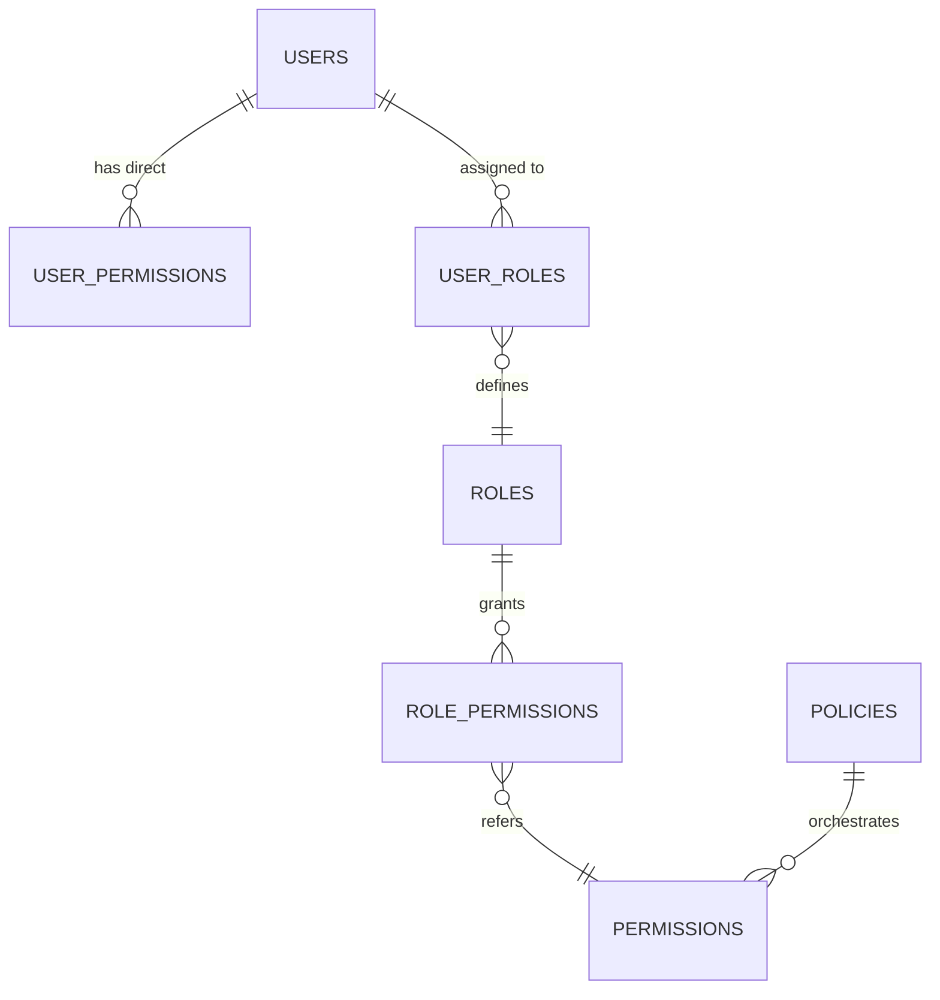

# ⚡ CENTRAL ERP API BACKEND BEM FT UNESA

**Domain**: `api.bemftunesa.org`
**Base URL**: `https://api.bemftunesa.org/v1` (Semua endpoint diawali dengan `/v1`)
**Version**: **v6.0 (Enterprise ERP Edition)**

---

## 1. 🎯 Tujuan & Arsitektur Monorepo

Sistem beralih dari _multi-repo_ menjadi **Monorepo Architecture** menggunakan **Turborepo**. Arsitektur ini mengelola **Central API Backend** (berbasis NestJS & Bun) beserta 5 Micro-Frontend Next.js secara tersentralisasi, guna memastikan konsistensi _dependencies_, sinkronisasi tipe data, dan pembagian _UI Component Library_.

```mermaid
graph TD
    subgraph Monorepo [Turborepo Workspace]
        subgraph Apps
            A[api - NestJS]
            B[ims - Next.js]
            C[public - Next.js]
            D[or - Next.js]
            E[shop - Next.js]
        end
        subgraph Packages [Shared Libraries]
            F[@bemft/ui]
            G[@bemft/auth]
            H[@bemft/database]
            I[@bemft/permissions]
        end
    end
    A --> H & I & G
    B & C & D & E --> F & G & I
```

---

## 🛡️ 2. Granular Permission System & Policy Engine

Sistem tidak lagi melakukan otorisasi _hardcoded_ berdasarkan "Role" statis, melainkan melalui **Permission Engine**.

### 2.1 Arsitektur Granular Permission

Hierarki izin berjenjang: **User ──► Roles ──► Permissions ──► Policies**

- **Direct Permission**: Memberikan hak istimewa langsung ke user spesifik (tanpa mengubah role default).
- **Inherited Permission**: Izin yang diturunkan dari struktur jabatan organisasi.
- **Scoped Access**: Izin terbatas pada _Scope_ tertentu (Global, Department, Event, atau Committee).



### 2.2 Configurable Workflow Engine (Policy Engine)

Sistem menggunakan _Workflow Engine_ dinamis berbasis JSON, bukan _hardcoded approval flow_. Jika BEM FT berganti kabinet dan ingin mengubah alur birokrasi, admin hanya perlu mengedit konfigurasi JSON.

**Contoh Definisi Workflow `proposal_approval`**:

```json
{
  "workflow": "proposal_approval",
  "steps": [
    "secretary_review",
    "treasurer_review",
    "sc_review",
    "wabem_approval",
    "kabem_approval"
  ]
}
```

---

## 🔐 3. Advanced Security & Access Guard

Keamanan setara perbankan _Enterprise_ (SaaS / FinTech):

- **API Permission Guards**: Setiap rute dilindungi dekorer `@RequirePermissions('finance.approve')`. Jika meleset, kembalikan 403 Forbidden.
- **Session Revocation & Trusted Devices**: Fitur _kick_ sesi aktif dari jarak jauh dan mendeteksi perangkat _login_ yang tidak dikenal.
- **MFA (TOTP)**: Persetujuan finansial mewajibkan kode token Google Authenticator (MFA) dari KaBEM dan Bendahara BEM.
- **Redis Rate Limiting**: Proteksi DDOS dengan _throttling_ adaptif di layer terluar.

---

## 🔔 4. Enterprise Notification System

Notifikasi berbasis prioritas yang diatur oleh antrean _background-job_ **BullMQ** & **Redis**:

- **Critical**: Peringatan batas waktu revisi LPJ (Email, WhatsApp).
- **High**: Permintaan _approval_ proposal (In-App, Telegram).
- **Medium**: Status perubahan dokumen (In-App).
- **Low**: Pembaruan sistem & changelog (In-App).

---

## 🕵️ 5. Audit & Event Logging

Setiap tindakan (_mutation_) di sistem dicatat secara _immutable_ di dalam koleksi `audit_logs` untuk menjaga integritas historis birokrasi:

- Melacak **approvals** dokumen
- Melacak **edits** pada nilai finansial / status proker
- Melacak **login history** dan perangkat
- Melacak transisi _state workflow_ (misal: "Draft" menjadi "Under Review")

---

## ⚙️ 6. Feature Flag System

Manajemen sakelar (_toggle_) fitur secara dinamis (tanpa harus melakukan _deployment_ ulang):

- **Module Activation**: Membuka atau menutup modul tertentu (contoh: Membuka Modul _Oprec OR_ hanya saat masa pendaftaran).
- **Maintenance Mode**: Mematikan `shop.bemftunesa.org` untuk perbaikan infrastruktur sementara waktu.

---

## 🤖 7. Future AI-Ready Architecture

_Data pipeline_ dirancang agar siap diintegrasikan dengan modul GenAI di masa depan:

- **AI-Generated LPJ**: Konversi otomatis poin notulensi dan riwayat _workflow_ menjadi draf dokumen narasi LPJ (menggunakan LLM Text Generation).
- **AI Meeting Summaries**: Ringkasan poin keputusan rapat secara instan.
- **AI Budget Recommendations**: Analisis preventif untuk mencegah alokasi _overspending_ RAB dengan mempelajari data komparatif _historical_ dari kabinet tahun-tahun sebelumnya.
- **AI Conflict Detection**: Memprediksi jadwal bentrok di masa depan berdasarkan tren pengadaan kegiatan departemen.
