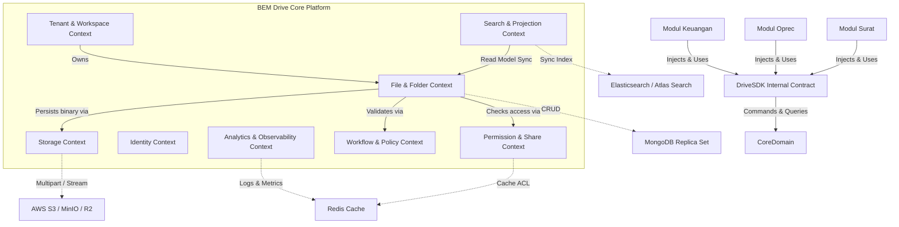
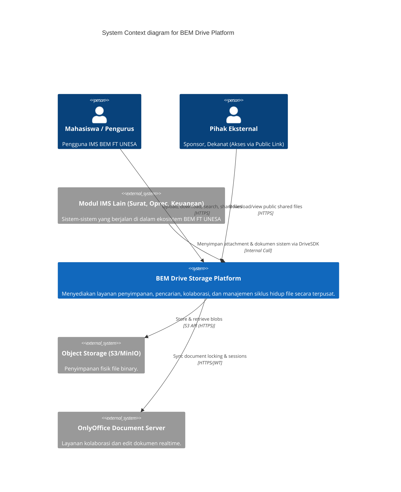
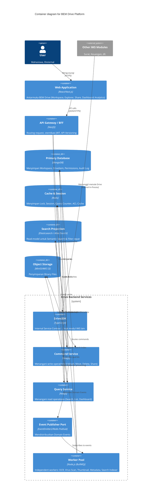
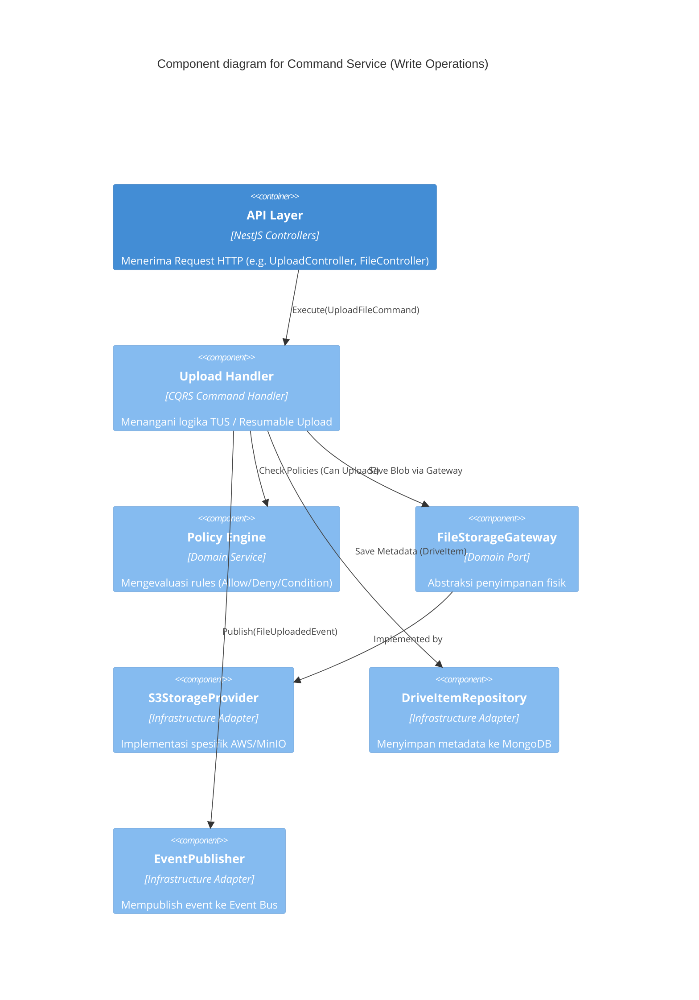

# Architecture Decision Record 01: Context Map & C4 Model

## 1. Domain Driven Design (DDD) Context Map

Peta konteks ini mendefinisikan batasan (Bounded Contexts) yang jelas di dalam BEM Drive sebagai sebuah Platform Service.

## 2. C4 Model - Level 1: System Context

## 3. C4 Model - Level 2: Container

## 4. C4 Model - Level 3: Component (Command Service)

