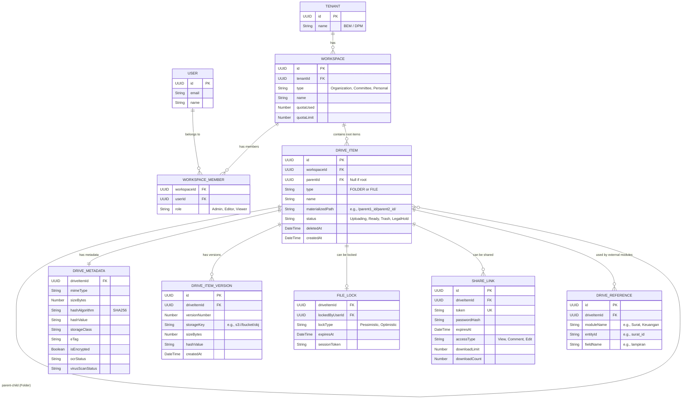

# Architecture Decision Record 02: Entity Relationship Diagram & DDD Aggregates

## 1. DDD Aggregate Boundaries

Sistem BEM Drive menerapkan prinsip Domain Driven Design (DDD) secara ketat. Berikut adalah batasan-batasan Agregat (Aggregate Boundaries) yang didefinisikan agar tidak terjadi percampuran (*bleeding*) state antar modul.

1. **Workspace Aggregate**
   - **Root**: `Workspace`
   - **Children**: `WorkspaceMember`, `WorkspaceRole`, `WorkspaceQuota`, `WorkspaceSettings`
   - **Aturan**: Setiap perubahan pada kuota, member, atau pengaturan workspace harus melalui root `Workspace`.

2. **Folder Aggregate**
   - **Root**: `Folder` (atau `DriveItem` bertipe Folder)
   - **Children**: Folder Metadata, `FolderAcl` (Inherited)
   - **Aturan**: Folder menggunakan strategi **Materialized Path** (`path: "/root_id/parent_id/"`) untuk traversal yang super cepat (O(1) menggunakan regex index).

3. **File Aggregate**
   - **Root**: `DriveItem` (bertipe File)
   - **Children**: `DriveItemMetadata`, `FileLock`, `DriveReference`
   - **Aturan**: Segala bentuk penambahan metadata (seperti hasil OCR, virus scan, atau checksum) harus dilakukan lewat root `DriveItem`. 

4. **Version Aggregate**
   - **Root**: `DriveItemVersion`
   - **Aturan**: Data versi bersifat **Immutable**. Jika file diupdate, tidak menimpa file fisik lama melainkan membuat object versi baru di S3 dan row baru di database.

5. **Policy Aggregate**
   - **Root**: `DrivePolicy`
   - **Aturan**: Definisi rule Allow/Deny dinamis yang akan dievaluasi oleh Policy Engine.

## 2. Entity Relationship Diagram (ERD)

Diagram ini menggambarkan relasi antar entitas inti dalam database (menggunakan MongoDB, divisualisasikan dalam bentuk relasional untuk kejelasan).

## 3. Catatan Strategi Desain Database
1. **Materialized Path (Folder Tree)**: Field `materializedPath` ditambahkan untuk menggantikan traversal rekursif ($graphLookup). Mencari semua anak dari folder `A` cukup query `WHERE materializedPath LIKE '/A/%'`.
2. **Immutable Versions**: Field `storageKey` berada di level `DRIVE_ITEM_VERSION`, bukan `DRIVE_ITEM`. Ini memastikan `DRIVE_ITEM` hanya sebagai *pointer* abstrak, sementara *binary* fisik file disimpan abadi sesuai versinya.
3. **Decoupled Extensions**: `DRIVE_REFERENCE` memastikan tabel Surat atau Keuangan tidak perlu dimodifikasi saat file dihapus/dipindahkan. Modul Drive yang akan memelihara integritas relasi ini.
