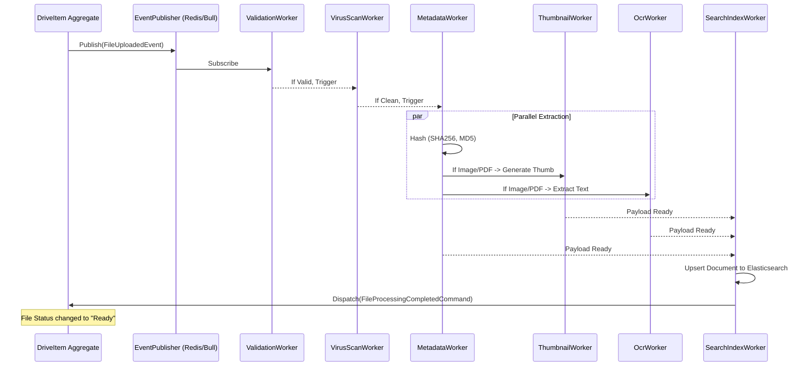

# Architecture Decision Record 03: Event Catalog & Message Broker Strategy

## 1. Strategi Event-Driven Architecture (Terdekopel)

BEM Drive MENGHINDARI penggunaan `EventEmitter2` atau Message Broker (seperti BullMQ/Kafka) yang dipanggil secara langsung (*hardcoded*) di dalam layer Domain (Entities & Services).

**Prinsip Desain:**
1. Layer **Domain** hanya menghasilkan *Domain Events* (objek plain TypeScript) dan menaruhnya di dalam *Aggregate Root* (`aggregate.addDomainEvent(event)`).
2. Ketika Aggregate disimpan, layer **Infrastructure (Repository)** akan mengekstrak event tersebut dan mengirimkannya ke `EventPublisherPort` (Interface).
3. Lapisan luar (Adapter) mengimplementasikan `EventPublisherPort` menggunakan teknologi pilihan (BullMQ, Redis Pub/Sub, Node EventEmitter, atau RabbitMQ).

Dengan cara ini, infrastruktur Message Broker dapat ditukar-tambah tanpa menyentuh sebaris pun kode *Business Logic*.

## 2. Event Catalog (Daftar Domain Event)

Berikut adalah daftar event mutlak yang diproduksi (Published) oleh agregat-agregat di dalam BEM Drive, beserta *independent workers* yang mendengarkan (Subscribe) ke event tersebut.

| Domain Event Name | Payload (DTO) | Publisher (Aggregate) | Subscribers / Workers | Deskripsi & Dampak |
| :--- | :--- | :--- | :--- | :--- |
| **`WorkspaceCreated`** | `workspaceId`, `tenantId`, `adminId` | Workspace | *AuditLogWorker*, *QuotaProvisioningWorker* | Memicu inisialisasi folder root dan setup kuota standar. |
| **`FolderCreated`** | `folderId`, `workspaceId`, `parentId` | DriveItem | *AuditLogWorker*, *SearchIndexWorker* | Mendaftarkan folder ke Elastic Search dan log audit. |
| **`FileUploaded`** | `fileId`, `workspaceId`, `versionId`, `mimeType`, `size` | DriveItem | *MetadataExtractWorker*, *VirusScanWorker*, *ThumbnailWorker*, *SearchIndexWorker*, *NotificationWorker* | **Krusial:** Event paling sibuk. Memantik *Processing Pipeline* secara paralel. Worker akan mengupdate *status* file menjadi `Ready` saat semua selesai. |
| **`FileVersionAdded`** | `fileId`, `newVersionId`, `authorId` | DriveItem | *AuditLogWorker*, *OnlyOfficeSyncWorker* | Memicu sinkronisasi status ke OnlyOffice Document Server (lock di-release). |
| **`FileDeleted`** | `fileId`, `workspaceId`, `deletedBy` | DriveItem | *SearchIndexWorker*, *NotificationWorker* (ke shared users) | Hanya *Soft Delete*. File pindah ke status `Trash`. |
| **`FileRestored`** | `fileId`, `workspaceId`, `restoredBy` | DriveItem | *SearchIndexWorker* | File kembali ke status `Ready`. |
| **`FilePurged`** | `fileId`, `storageKeys[]` | DriveItem | *StorageCleanupWorker* | **Hard Delete**. Worker akan memerintahkan S3/MinIO untuk menghapus binary fisik (blob) secara permanen. |
| **`FileMoved`** | `fileId`, `oldParentId`, `newParentId` | DriveItem | *SearchIndexWorker*, *AclResolverWorker* | Materialized path berubah. ACL Cache di Redis direvalidasi. |
| **`ShareLinkCreated`** | `fileId`, `shareId`, `accessType` | ShareLink | *NotificationWorker*, *AuditLogWorker* | Mengirim email/push notifikasi kepada pihak yang diundang (jika spesifik). |
| **`LockAcquired`** | `fileId`, `userId`, `sessionToken` | FileLock | *CollaborationPresenceWorker* | Mengaktifkan status "Currently Editing by X" di UI realtime (WebSockets). |
| **`LockReleased`** | `fileId`, `userId` | FileLock | *CollaborationPresenceWorker* | Menghapus status "Editing", file bisa disunting orang lain. |
| **`QuotaExceeded`** | `workspaceId`, `attemptedSize` | Workspace | *NotificationWorker*, *BillingWorker* (Future) | Mencegat upload dan mengirim peringatan ke Admin Workspace. |

## 3. Topologi Processing Pipeline (Khusus FileUploaded)

