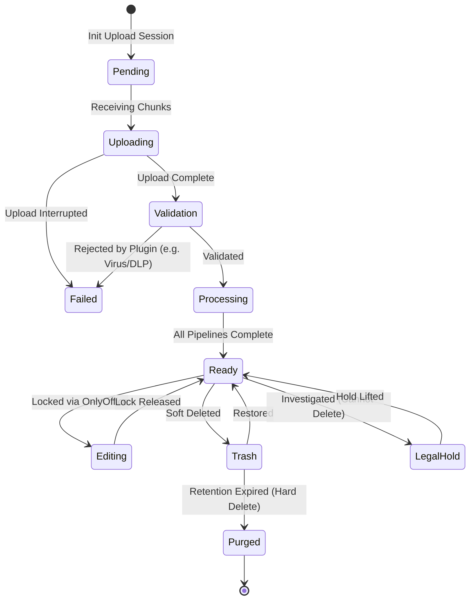

# Architecture Decision Record 05: State Machines & Folder Strategy

## 1. File Lifecycle State Machine

Siklus hidup file (Lifecycle) dalam BEM Drive direpresentasikan secara eksplisit melalui Status Machine. File tidak sekadar "Ada" atau "Tidak Ada".



**Penjelasan Status:**
- `Pending`: Sesi upload baru saja dibuat (TUS protocol), belum ada byte yang ditransfer.
- `Uploading`: Klien sedang mengirimkan chunk data.
- `Validation`: Mencegat file dengan *Magic Byte Detection* dan *Virus Scan* awal.
- `Processing`: Pekerjaan berat asinkron sedang berjalan (OCR, Extract Metadata, Index Search). File belum muncul di Search, tetapi sudah bisa diakses spesifik ID-nya.
- `Ready`: Status final, aman digunakan, dicari, dan dibagikan.
- `LegalHold`: File ditandai secara manual atau otomatis oleh Policy Engine agar kebal terhadap instruksi *Delete* (Soft maupun Hard) sampai Hold dicabut.
- `Purged`: Binary telah dihapus selamanya dari S3. Row DB mungkin masih ada untuk kepentingan audit.

## 2. Folder Tree Strategy (Materialized Path)

Mengingat file dan folder dapat bersarang tanpa batas (N-Depth Hierarchy), menggunakan pendekatan `parentId` secara tradisional (Adjacency List) menyebabkan query yang sangat berat (`$graphLookup` di MongoDB atau rekursif di SQL).

Oleh karena itu, BEM Drive menggunakan **Materialized Path Pattern**.

### Konsep Dasar
Setiap folder/file menyimpan jalur nenek moyangnya dalam format string terstruktur.

| ID | Name | Parent ID | Materialized Path |
| :--- | :--- | :--- | :--- |
| `W1` | (Root Workspace) | `null` | `/` |
| `F1` | Laporan | `W1` | `/W1/` |
| `F2` | 2026 | `F1` | `/W1/F1/` |
| `D1` | proposal.pdf | `F2` | `/W1/F1/F2/` |

### Keuntungan Opsi Ini (Query Performance)
1. **Mencari Seluruh Keturunan (Get All Descendants)**
   Untuk mencari semua file di dalam folder `Laporan` (`F1`), termasuk di dalam sub-sub foldernya:
   ```javascript
   // Query super cepat (Menggunakan B-Tree Index Regex)
   db.drive_items.find({ materializedPath: /^/W1/F1// })
   ```
2. **Mencari Silsilah Nenek Moyang (Get Ancestors)**
   Untuk memunculkan *Breadcrumb* dari `proposal.pdf` (`D1`):
   Kita cukup memecah string `/W1/F1/F2/` berdasarkan garis miring (`/`), lalu melakukan klausa `$in`:
   ```javascript
   db.drive_items.find({ id: { $in: ['W1', 'F1', 'F2'] } })
   ```

### Kelemahan & Mitigasi (Pindah Folder)
Kelemahan Materialized Path adalah ketika memindahkan (Move) sebuah Folder, *path* seluruh keturunannya harus diupdate.

**Mitigasi (Saga & Background Job):**
Pemindahan folder tidak dilakukan sinkron.
1. `MoveFolderCommand` merubah `parentId` dari Folder target.
2. Mem-publish `FolderMoved` event.
3. *Background Worker* mengeksekusi Bulk Update untuk me-*replace* prefix `materializedPath` dari seluruh keturunannya secara batching agar tidak *timeout*. Selama proses berjalan, folder ditandai berstatus `Processing`.
