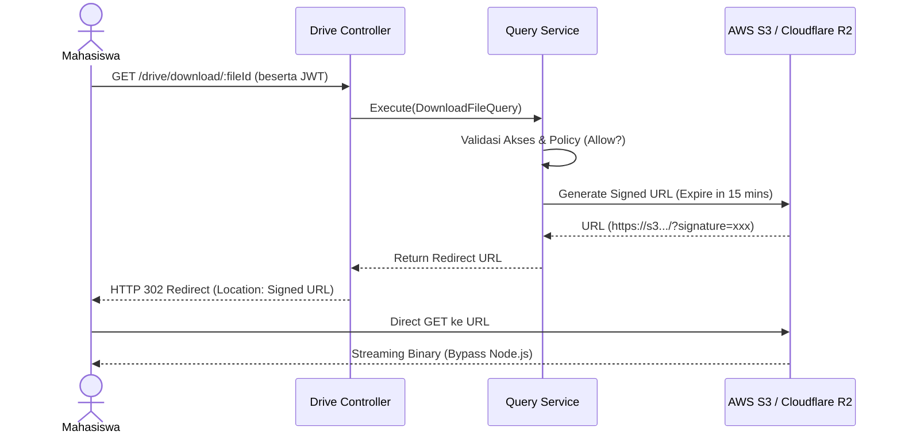
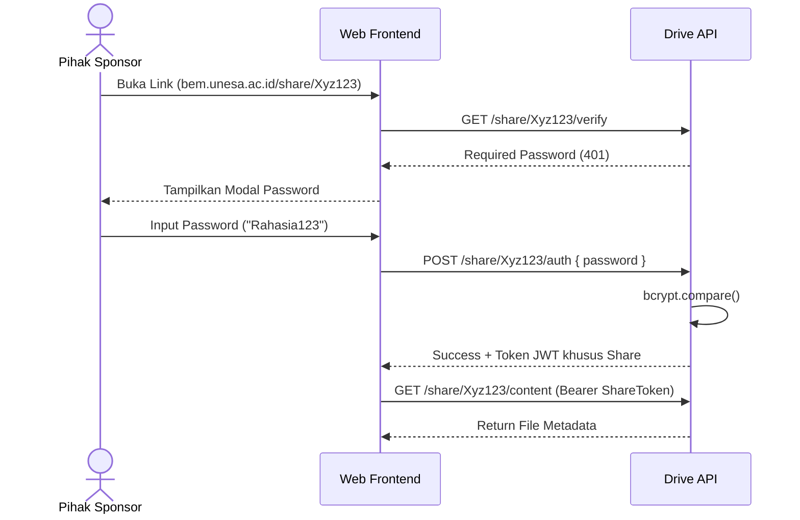
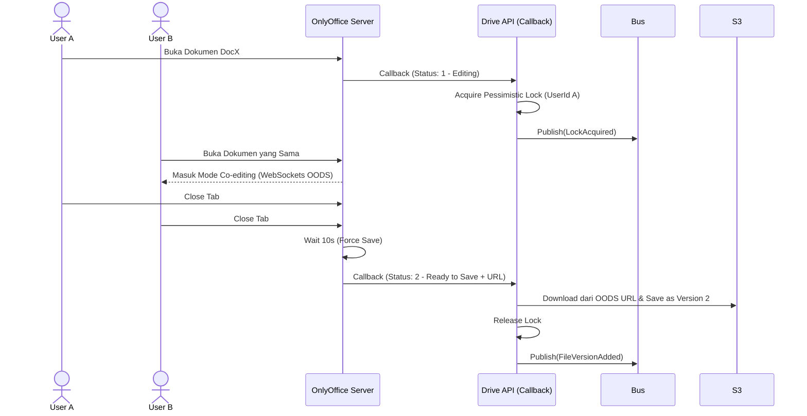

# Architecture Decision Record 06: Sequence Diagrams

## 1. Flow: Internal Modular Upload (Via DriveSDK)

Sequence ini mendemonstrasikan bagaimana modul IMS lain (contoh: Modul Surat) menggunakan `DriveSDK` untuk mengunggah lampiran dengan aman, tanpa melalui HTTP REST.

```mermaid
sequenceDiagram
    actor Pengurus as Pengurus (User)
    participant API as Surat Controller
    participant SDK as DriveSDK (Injected)
    participant Cmd as Drive Command Service
    participant S3 as S3StorageProvider
    participant DB as MongoDB (DriveItem)
    participant Bus as EventPublisher
    
    Pengurus->>API: POST /surat (File: proposal.pdf)
    
    API->>API: Save Data Surat (Transactional)
    
    API->>SDK: upload({ fileBuffer, moduleName: "SURAT", entityId: "123" })
    
    SDK->>Cmd: Execute(UploadFileCommand)
    
    Cmd->>Cmd: Validasi Policy & Mime
    Cmd->>S3: Stream Buffer ke Cloud
    S3-->>Cmd: Return storageKey & eTag
    
    Cmd->>DB: Insert DriveItem (Status: Processing)
    Cmd->>DB: Insert DriveReference (Link Surat 123)
    
    Cmd->>Bus: Publish(FileUploadedEvent)
    
    Cmd-->>SDK: Return DriveItem Entity
    SDK-->>API: DriveItem (id)
    API-->>Pengurus: Sukses Membuat Surat
```

## 2. Flow: Public Download via Signed URL

Untuk keamanan tinggi, BEM Drive tidak melayani unduhan binary file secara langsung melalui Node.js, melainkan memberikan otoritas terbatas berupa *Signed URL*.

## 3. Flow: Shared Password Access

## 4. Flow: OnlyOffice Co-authoring (Pessimistic Lock)

