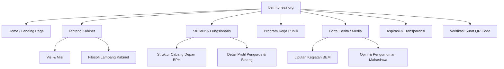

# 🌐 HEADLESS CMS PUBLIC WEB BEM FT UNESA

**Domain**: `bemftunesa.org`
**Version**: **v3.0 (Enterprise ERP Edition)**

---

## 🎯 1. Deskripsi & Tujuan

Website publik **BEM FT UNESA** berfungsi sebagai **wajah media digital utama** organisasi. Menggunakan arsitektur **Headless CMS**, seluruh informasi profil organisasi, jajaran fungsionaris, program kerja, artikel berita, dan dokumentasi kegiatan tidak ditulis secara statis (hardcoded), melainkan disajikan secara dinamis dari **Central ERP API**.

```
 [VISITOR (bemftunesa.org)] ──► [Next.js ISR Layer (Incremental Static)]
                                            │
                                            â–¼
                               [Central API / MongoDB Data]
                               (Managed via IMS CMS Module)
```

### Core Public Web Objectives:

- **SEO-First Performance**: Penggunaan optimal SSG (Static Site Generation) dan ISR (Incremental Static Regeneration) untuk meminimalkan waktu respon halaman (LCP < 1.2 detik).
- **Headless Data Ingestion**: Seluruh komponen dinamis (kartu pengurus departemen, progres proker, berita) bersumber dari endpoint publik terenkripsi.
- **Transparent Document Verification**: Mengakomodasi validasi dokumen digital BEM FT secara instan melalui pencocokan kode hash QR Code.

---

## 🗺️ 2. Sitemap & Arsitektur Konten



---

## 🧩 3. Fitur Utama Platform

### 3.1 Headless CMS Hub

- **Incremental Static Regeneration (ISR)**: Next.js mengompilasi halaman artikel berita secara statis untuk performa loading kilat. Pemicu revalidasi berjalan setiap 60 detik di latar belakang saat artikel baru diterbitkan di IMS.
- **Semantic Organization Chart Tree**: Visualisasi bagan kepengurusan kabinet interaktif yang merender relasi departemen secara otomatis berdasarkan profil pengguna aktif di database.

### 3.2 Aspirasi Mahasiswa (Public Aspiration Box)

- **Encrypted Submission**: Mahasiswa dapat menyalurkan kritik atau rekomendasi fasilitas secara anonim. Payload dikirim terenkripsi ke backend.
- **Public Tracking Code**: Pengirim aspirasi menerima kode pelacakan unik untuk memantau status penyelesaian aspirasi di IMS (status: `Diterima` -> `Didisposisikan` -> `Diproses` -> `Selesai`).

### 3.3 Verifikasi Keabsahan Surat (Document QR Verifier)

- **Secure Validation**: Setiap surat resmi BEM FT dilengkapi QR Code unik yang menunjuk ke rute `verify/[UUID]`.
- **State Verification**: Halaman verifikasi melakukan lookup database untuk menampilkan detail judul surat, nomor surat resmi, nama fungsionaris penandatangan, tanggal terbit, serta status keabsahan dokumen (Sah / Kadaluwarsa).

---

## 🧱 4. Arsitektur Teknis & Struktur Aplikasi

### 4.1 Tech Stack

- **Framework**: Next.js 15 (App Router)
- **Styling**: Tailwind CSS + shadcn/ui + Glassmorphism effects
- **Data Ingestion**: Axios / TanStack Query -> `api.bemftunesa.org/v1/public/*`
- **Performance Check**: Google Lighthouse Score target > 95 (Core Web Vitals Optimal)

### 4.2 App Structure

```
apps/public/
├── app/
│   ├── page.tsx                     # Landing Page (Highlights, Stat Counter, CTA)
│   ├── tentang/
│   │   ├── visi-misi/page.tsx       # Visi & Misi Kabinet
│   │   └── kabinet/page.tsx         # Filosofi & Informasi Kabinet
│   ├── struktur/page.tsx            # Tree Bagan Kepengurusan Dinamis
│   ├── proker/
│   │   ├── page.tsx                 # Grid Timeline Program Kerja Kabinet
│   │   └── [slug]/page.tsx          # Detail & Dokumentasi Proker Selesai
│   ├── berita/
│   │   ├── page.tsx                 # Portal Berita & Pengumuman (Paginated)
│   │   └── [slug]/page.tsx          # Detail Artikel (ISR Rendered)
│   ├── aspirasi/page.tsx            # Form Pengaduan & Tracking Aspirasi
│   ├── verify/
│   │   ├── check/page.tsx           # Form Input Manual Cek UUID Surat
│   │   └── [uuid]/page.tsx          # Tampilan Validitas Surat Resmi QR
│   └── layout.tsx
└── components/
    ├── home/
    │   ├── stats-counter.tsx        # Widget animasi counter pencapaian proker
    │   └── quick-nav.tsx            # Navigasi cepat antar-portal ekosistem
    └── layout/
        ├── navbar.tsx               # Transparent Glassmorphic Navigation bar
        └── footer.tsx               # Footer informasi alamat & media sosial
```

---

## 🗂️ 5. Skema Integrasi API Terpusat

- **Get Berita Publik**: `GET api.bemftunesa.org/public/articles`
- **Get Proker Aktif**: `GET api.bemftunesa.org/public/proker`
- **Submit Aspirasi**: `POST api.bemftunesa.org/public/aspirations`
- **Verify Surat QR**: `GET api.bemftunesa.org/public/verify/:uuid`
